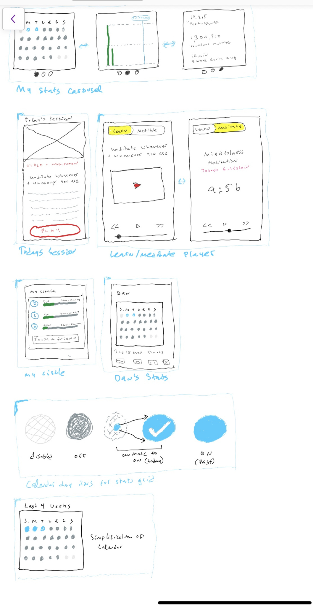
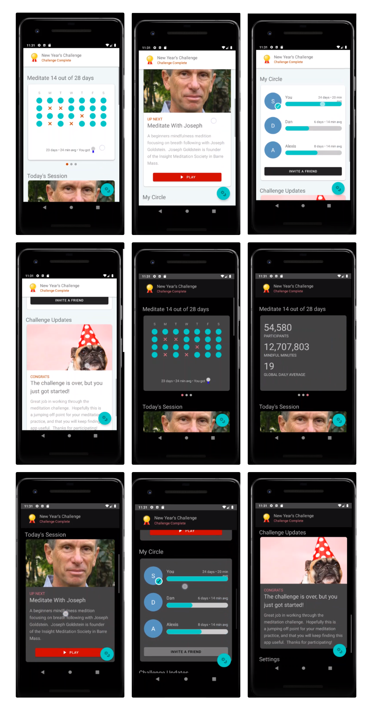

# Code Sample - The Ten Percent Happier App by Dan Harris -- UI Study.
### By Sam Halperin

Intro:
======
Over the past couple of weeks I made a reasonably complete UI study of the 10% Happier meditation application’s meditation challenge feature. There is a tradition in Fine Arts education of making reproductions of masterworks, and this project follows in that tradition.

The Sketches:
=============
I took some time to make some sketches from Dan Harris' app.  In a real workflow, these sketches might be a collaboration between me and UXD.  The sketches and a subsequent comp are a reasonably complete specification of what needs to be built.

And The Finished Result:
========================

To Build:
=========
It should be straightforward to just clone the project and open it in Android Studio.  

Project Structure:
==================
There are 2 modules in this project
+ _Library_: I moved a lot of code into a reuseable UI Library.
+ _MeditationChallenge_: The feature you see above.  This is a self-contained fragment that you could drop into a larger app.

Architecture:
=============
The organizing principle here are _component_ Fragments built with  Android MVVMs. Components talk to each other via ViewModels, which are reactively bound to their frontend code.

Where to Go From Here:
======================
I would like to explore Android Jetpack Compose.

