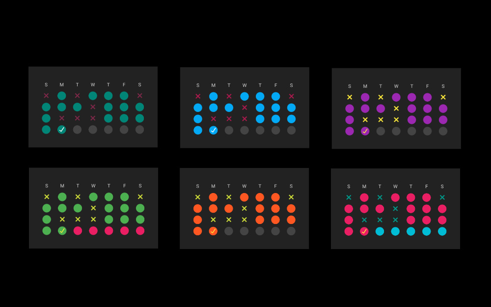
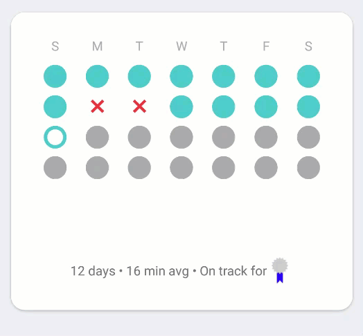

Screenshots that may be more or less out of date:
=================================================

Notes:
======
+ Two modules: sample and a library for reusable components
+ Implements AndroidX Navigation
+ Uses MVVM as an architecture
+ Tests: I need more, but there is a good prototype for testing ViewModels in there.
+ Implements night/day switchable theme.

To Build:
=========
Should be straightforward to just clone the project and open it in Android Studio.

